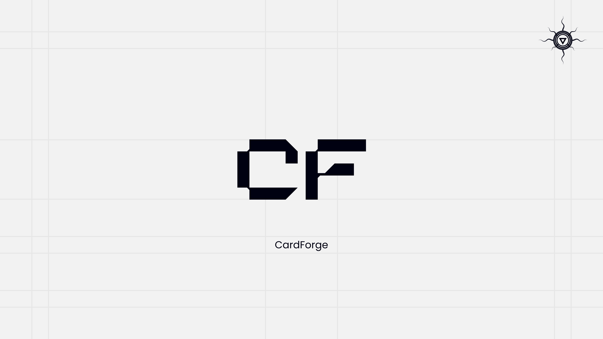

# CardForge



## Usage

```console
roothazard@viper$ poetry install
roothazard@viper$ poetry run ./forge_prepare examples/gpt
roothazard@viper$ # Add images and files into prepared folders
roothazard@viper$ poetry run ./card_forge examples/gpt
roothazard@viper$ ls examples/gpt/card-forge.image # Artifact
```

## User Manual

* Create project folder. Name it as you want to. Take a look at examples
* Create [config file](#config-file) in project folder config file
* Run preparation script `forge_prepare` to create directories structure acceptable to `card_forge` utility
* Preparation script will create `preparation` directory in [project directory](#preparation-results)
* Add files in [partitions_data](#partitions_data-directory) directory
* Run forge `card_forge` utility to generate image from `preparation` directory
* Get your artifact in project folder named card-forge.image

## Preparation results

Preparation directory contains `configs` and `partitions_data` directories

### `configs` directory

At least contains `fdisk_layout` and `layout_env`, but may contain more in accordance with `additional_configs`.
* `fdisk_layout` used for building image partition table
* `layout_env` helpful in scripts to interact with partition table and separate partitions

### `partitions_data` directory

For each partition in [config file](#config-file) will be created directory

In partitions directories for partitions that require files be as part of some filesystem like `ext4` or `fat16` will be additional folder named as a filesystem required. Place your files in such subfolder and `card_forge` will generate image that contain filesystem and your files with name `${partition_name}.image`.

For partitions which you want to fill with binaries like TF-A or UBoot, just place binary in partition folder and name it `${partition_name}.image` and `card_forge` will do its job

## Config File

Config file must have name `image.yaml`

### Required first level keys

* `flash`: describes what you want to get on your flash: partitions, filesystems
* `additional_configs`: run configuration handlers which can give you some custom configs for custom utilities e.g `uboot_env_file` give you env variables for uboot which will help you configure flash from it

### Required flash keys

#### label

Currently CardForge project supports:
* dos
* gpt

#### sector_size

Sector size for your storage device. I always used 512 and it worked why don't you?

#### size_in_bytes

The size of your flash memory in sectors. Very useful when you need many large partitions. You may forget that you have boundaries, and by checking this field `card_forge ` will know if you want too much.

#### partititons

This is table specific but follow such structure and everything should be fine:

```yaml
partition_name:
    min_size_in_bytes: X # There are some things like minimal size of filesystem and alignment so you set your size card_forge will add some parts that you missed, so final partitions size will be bigger or equal
    partition_type: Y # Quite specific for table check fdisk variants for type=
    fs_generation_handler: Z # null - you will provide partition_name.image, some filesystem like 'fat16' - you will place your files in partition_name/fat16
```

Anyway I have examples for each table, so it should be understandable
